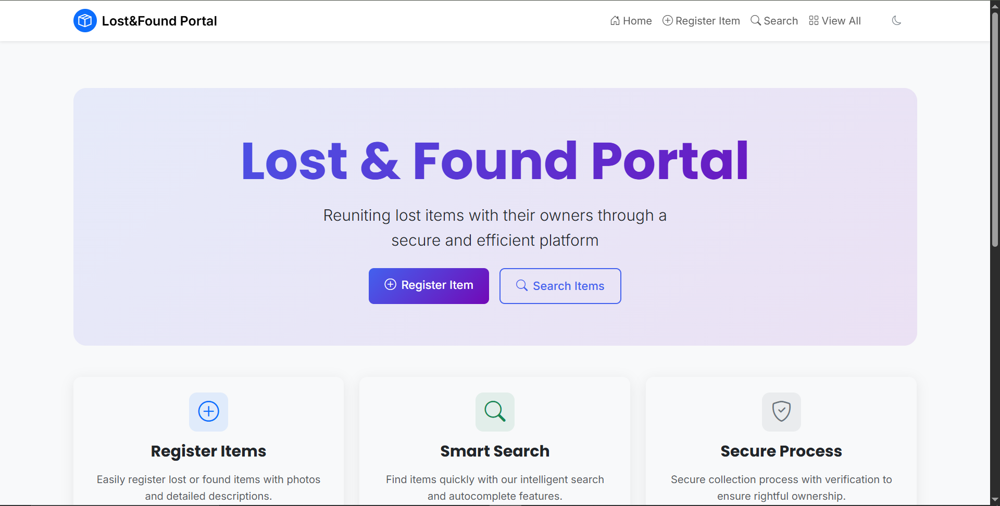
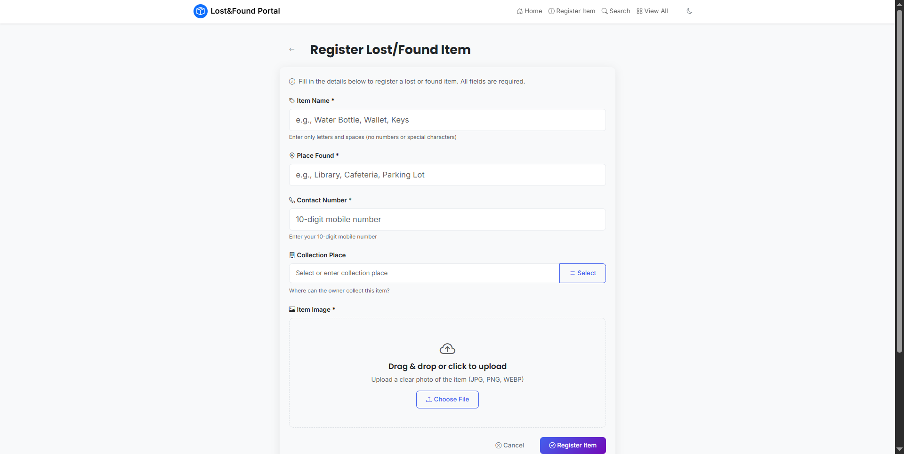
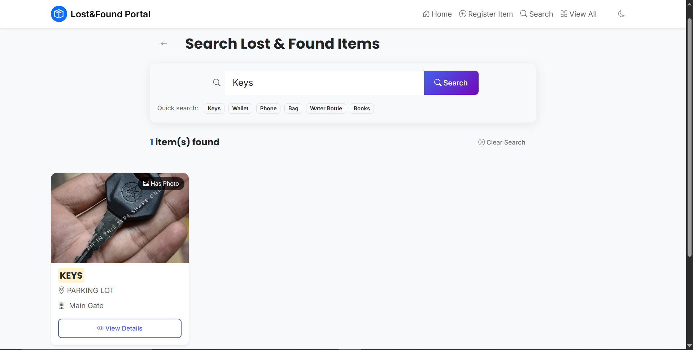
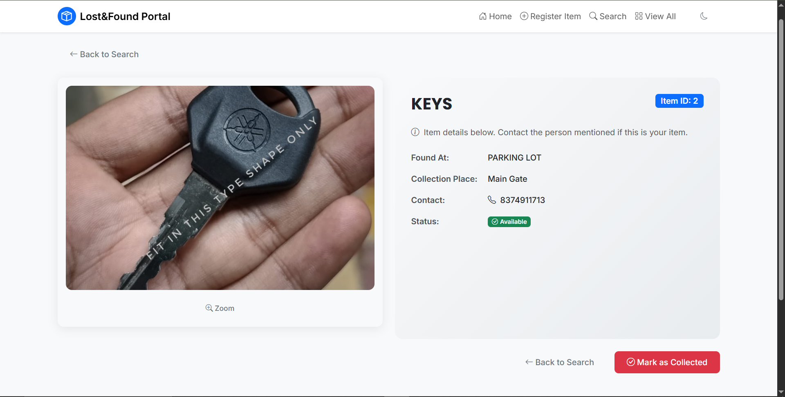
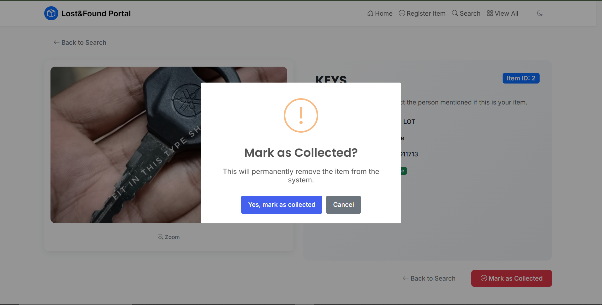

# Lost and Found Portal

A web-based Lost and Found Portal developed using Flask and SQLite.  
It allows users to report, search, and manage lost & found items efficiently.

---

## 🚀 Features

- User Registration and Login  
- Report Lost Items  
- Report Found Items  
- Search Items  
- View Item Details  
- Mark Items as Collected  
- Responsive User Interface  

---

## 🛠️ Technologies Used

- Python  
- Flask  
- SQLite  
- HTML  
- CSS  
- JavaScript  

---

## 📸 Output Screenshots

### Home Page


### Register Page


### Search Page


### Item View Page


### Item Collected Page


---

## ⚙️ Installation

```bash
git clone <repository-url>
cd lost_found_portal

python -m venv venv
venv\Scripts\activate

pip install -r requirements.txt

python app.py

## Live Demo

🔗 [Visit Project](https://lost-found-portal-1-ivnk.onrender.com)

⚠ Note: It may take 20–30 seconds to load initially due to free hosting.

## Author

Abhiram Yagooru
